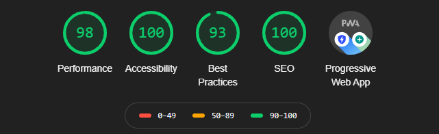
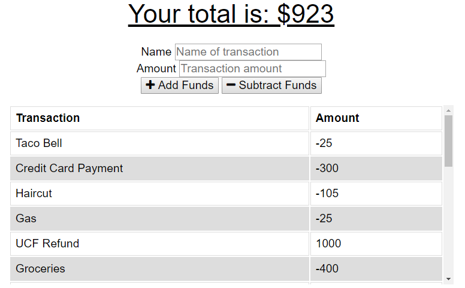
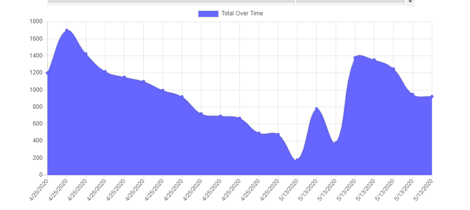

# PWA-budget-tracker
A Budget Tracker progressive web app for online and offline use.

## Description
The application tracks deposits and expenses in a chart for the user to analyze. The application also serves offline functionality utilizing a service worker and indexedDB.

### Table of Contents
I. Title
II. Description
III. Table of Contents
IV. Installation
V. Visuals
VI. Usage
VII. License
VIII. Contributing
IX. Test(s)
X. Questions
    
## Installation
The user will need run npm i to run the application locally.

## Visuals

LIGHTHOUSE AUDIT
 

IMAGES
 

    
## Usage
The application takes user input for both name of transaction and amount of transaction. The user then clicks either the add or subtract funds button. The application stores the information in a MongoDB database or in an indexedDB store, depending on whether the connection is online or offline respectively. 

## License

    
## Contributing
None

## Test(s)
N/A

## Questions
If you have any questions, please feel free to contact me below.

Email: alexjoeldelgado@gmail.com

<a href='https://github.com/alexjoeldelgado'>Github Profile: alexjoeldelgado</a>

